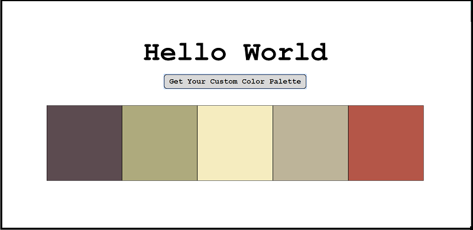
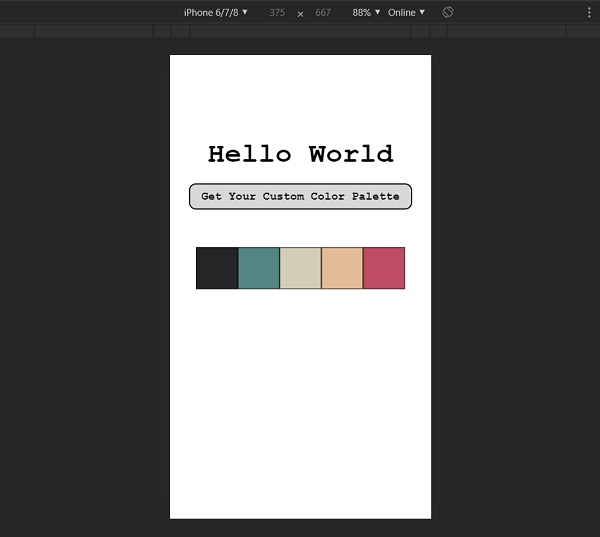

# Color Palette Generator App   

***Problem***: It can be hard to put together pleasing color combinations. 
 
***Solution***: This application solves that problem by generating an aesthetic color palette with the click of a button.

# Motivation :art:
My interests in painting and visual design made me realize that there is a lot to color theory and what makes good color combinations. A tool like this not only helps to provide ideas for color schemes, but can provide inspiration to a brand new project. 

# Technology
This application is made using JavaScript and CSS. The data used to generate the color palettes comes from the public API for Colormind. 

# Demo
Here you can observe examples of color palettes that get generated as well as the responsiveness of the application.
### On a Wide Resolution:

### On a Small Resolution:

# Future Improvements
* In the future, I plan to look for a similar API, but one that has a secure HTTPS endpoint so that I can host it on a secure website. 
* Another conderation would be to include an **SVG** image that gets colored in using the generated color palette as a means of displaying their custom palette. 
* Additionally, I plan to add corresponding color values in the form of HEX values and their closest-matching Pantone color names.
